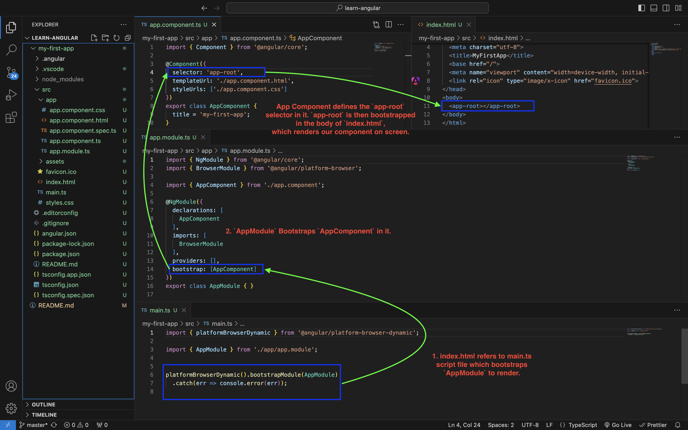
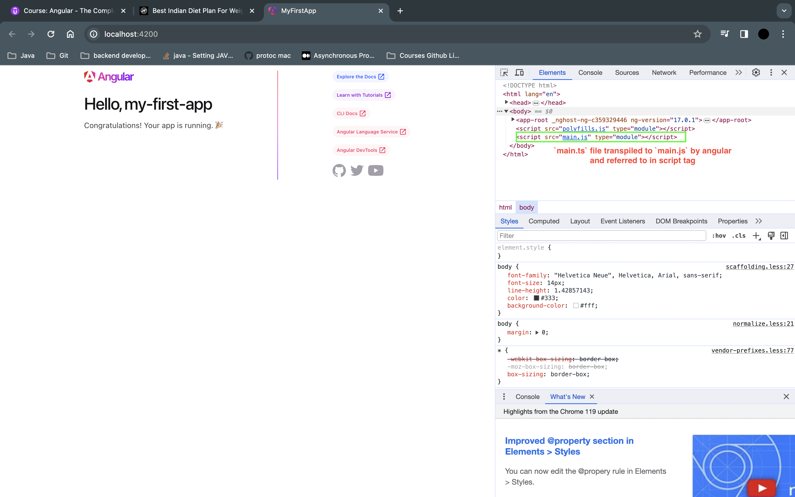
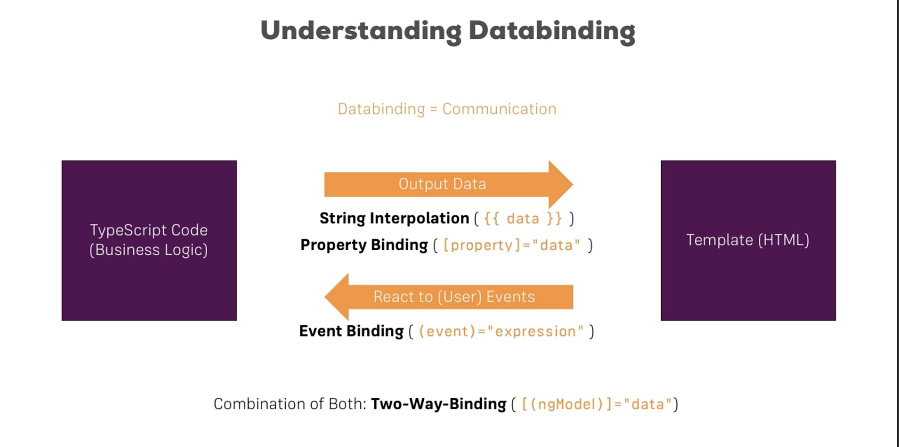
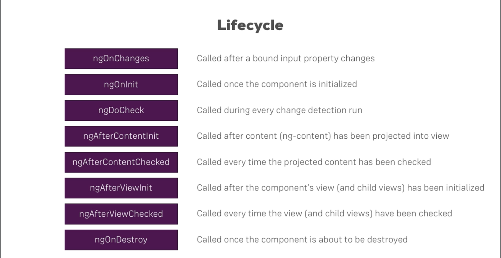

# Angular

## What is Angular

1. Angular is a JavaScript based framework that allows us to build reactive Single Page Applications.
2. Web applications are pretty much a HTML,CSS and Javascript file loaded from the server and rendered on to the browser.
3. SPA keeps a single base HTML file, and utilizes JavaScript to navigate between the pages w/o reaching out to server everytime. This enhances performance and hence we never see refresh button loading everytime we move from one view to another in Single Page web applications.
4. This single page behavior is obtained with the help of manipulation of DOM elements by Javascript.

## Setting up angular dev project and environment

1. Install Node.js
2. run `npm install @angular/cli`
3. run `npx -p @angular/cli ng new <project-name>` `npx -p @angular/cli ng new my-first-app --no-strict --standalone false --routing false`
4. Install bootstrap by running `npm install --save bootstrap@3`. Also in `angular.json` file add the entry to `bootstrap.min.css` file path in `project->architect->build->styles` array.

## How does the angular application kick off?

1. Angular application, as we discussed is a single page application. `index.html` file is the single page rendered by Angular.
2. Following is a high level rendering flow.

**Angular rendering flow diagram**


**`main.ts` transpiled as `main.js` and referred to in script tag as part of index.html automatically when app is built**


## Components in angular

1. A typical webpage might have many parts to it, like for e.g. Title, Header, Navbar, Navbar elements, Main page, sidebar, sidebar elements, footer etc.
2. Normal approach is to crunch all these in a single html file.
3. Angular provides a more streamlined approach. It allows to break down application into more isolated, resusable parts with each part having its own structure,styling and business logic.
4. These parts are later fit together to form the application.
5. These small, isolated, reusable parts are called components and forms the building blocks of angular application.
6. In angular apps, typically the app-component is the base or root component wherein we arrange these smaller components according to our logic to create an application. The AppComponent is usually bootstrapped in appModule, and we do not bootstrap other components, but rather import them into the module and use them within app-component
7. Use `ng g c <component-name>` to create a new component, and register it with its module.
8. A new component, generally has its own structure,style and logic, isolated from other components, but reusable as a whole anywhere needed. Hence it typically has its own html,css and ts files, encapsulated in a single folder, as a best practice. The above command does it for us.
9. Import these components into the declarations array of the `app.module.ts` file and start using them, as the custom tags in `app.component.html` file.

## Databinding

1. Databinding simply refers to communication between the template(html) and business logic(typescript).
2. It is needed in scenarios where we require to output some data onto the screen, or react to user events from screen.
3. Data binding can be one way or two way.
   

## Types of databinding

1. String Interpolation
   1. `{{ <any expression that can be resolved to string> }}` -> This is string interpolation.
   2. Used in template files to dynamically display content.
   3. Anything like variable,function or expressions that can be resolved into valid string is acceptable in string interpolation syntax.
   4. To be used when to display dynamic content.
2. Property binding
   1. `<button [disabled]="!allowNewServer"></button>` -> This is property binding.
   2. The logic (anything like variable,function or expressions) is bound to a property of a tag, thereby affecting the property dynamically.
   3. Here in example `allowNewServer` is a variable in `.ts` file of the component and it handles whether the button to be enabled or not.
   4. This affects the behavior of the button dynamically.
   5. To be used to control behavior of template elements dynamically.
3. Event binding
   1. `<button (click)="onCreateServer()"></button>` -> This is event binding.
   2. Event binding is typically to perform some action (execute some code) on a specific user event.
   3. We bind a functionality to whatever user performs.
   4. `$event` is a reserved keyword in angular, that passes a lot of metadata for an event taking place. Using this makes life easier. Log the event object to console to learn more. This can be passed as parameter to the functions.
4. Two way binding
   1. Two Way Data binding requires a special directive in angular called as `ngModel` which needs to be imported from `FormsModule` (added in imports[] array of `NgModule` decorator in `AppModule.ts`);
   2. Its uses banana in a box syntax
   3. eg:
      ```html
      <input [(ngModel)]="userName" />
      <p>{{ userName }}</p>
      ```
   4. In the above example changes made in input field is fed into the variable `userName` and the same changes are dynamically displayed back onto the screen in paragraph.
5. **Note: You can get a list of properties and events which you can bind to, from MDN docs**

## Directives in Angular


1. Directives are instructions to the DOM.
2. Components are kind of directives with templates. Because we specify the component selector in our html code, that plugs in the component template and its business logic in our html page.
3. But directives can also be attributes to a specific selector, that perform specific actions on the tag which it is attached to.
4. We can write our custom directives, but angular provides us with some useful ones like `ngIf` and `ngFor`.

   1. `ngIf` directive ->
      1. Structural directive, modifies dom in realtime. Need to put `*` before the directive.
      2. Enables structure only if the boolean condition matches.
      3. Eg:
         ```html
         <p *ngIf="!isEmpty()">The entered username is : {{ userName }}</p>
         ```
      4. To show something for else condition do the following:
         1. Add an `ng-template` with a marker
            ```html
            <p *ngIf="!isEmpty(); else noUserName">
              The entered username is : {{ userName }}
            </p>
            <ng-template #noUserName>
              <p>No username is entered</p>
            </ng-template>
            ```
         2. ngIf can also be used as follows, and this is what happens in background when we use `*ngIf`
            ```html
            <ng-template [ngIf]="!isEmpty()">
              <p>No username is entered</p>
            </ng-template>
            ```
   2. `ngStyle` directive ->

      1. `ngStyle` is a property directive. It is used to dynamically style the tag in question.
      2. Eg:
         ```html
         <p [ngStyle]="{backgroundColor: getColor()}">
           Server status is {{ serverStatus }}
         </p>
         ```
      3. Here the background color of the paragraph is set by function `getColor()`. Get color returns color name based on `serverStatus` value, like green when serverStatus is online or red otherwise.

   3. `ngClass` directive ->

      1. `ngClass` is a property directive. It is used to dynamically set the class to a tag in question.
      2. Eg:<br>
         html
         ```html
         <p [ngClass]="{online: serverStatus==='online'}">
           Server status is {{ serverStatus }}
         </p>
         ```
         css
         ```css
         .online {
           background-color: green;
         }
         ```
      3. Here the `online` class is set to the `p` tag based on the expression withing `ngClass`. online class sets the background color as green if value of `serverStatus` variable is `'online'`

   4. `ngSwitch` directive ->

      ```html
      <!-- oddOrEven is a variable whose value can be 'odd' or 'even' -->
      <div [ngSwitch]="oddOrEven">
        <p *ngSwitchCase="'odd'" style="color: brown">Odd Number Generated</p>
        <p *ngSwitchCase="'even'" style="color: green">Even Number Generated</p>
        <p *ngSwitchDefault>
          No Number Generated. Click start to generate number
        </p>
      </div>
      ```

   5. To create a custom attribute directive:

      1. create a ts class and add a decorator `@Directive({selector:'[selector-name]'})`.
      2. In the directive constructor, accept a variable of type `ElementRef`
      3. Add the directive to the declarations array in `app.module.ts`
      4. Use the directive in any of the tags we desire.
      5. Or We could use `ng g d <directive-name>` and skip 1-4 steps

   6. We can use `@HostBinding` to bind to the desired element property and `@HostListener` to listen to a desired event and achieve required behaviour on the bound property if element

   7. We can also use `ElementRef` and `Renderer2` to bind and alter the property but the above is better suited.

# Binding custom properties and events in angular

## Binding custom properties

1. Custom properties can be used to pass data between components.
2. Any property of a component having decorator `@Input()` attached to it, bbecomes a bindable property of that custom component.
3. We can bind this property from other components to pass values to and fro the components.
4. We can also provide aliases as a parameter into the `@Input()` decorator, and this alias will the the custom property name

## Binding custom events

1. Custom events can be raised to emit data from a component to outside world
2. Any property of type `EventEmitter<>` having decorator `@Output` attached to it, becomes a bindable event of that custom component
3. Eventemitter emits events with data. This data can be received with `$event` object within the event binding syntax of the custom event in html.
4. We can also provide aliases as a parameter into the `@Output()` decorator, and this alias will the the custom event name

## View encapsulation in angular

1. View encapsulation is the default behavior of angular componenets
2. View encapsulation means, the styling applied in css file of a component, is only applicable to that component, and not anywhere else, by default.
3. This is because angular internally creates sepcialized elements/tags for each component with unique ids, and styling is pplied to these elements individually.
4. This behavior can be controlled by `encapsulation` property and its values in `@Component` decorator.
5. [View Encapsulation](https://angular.io/guide/view-encapsulation)

## Template reference in angular

1. Reference to a html element/tag can be passed as a whole to a typescript object in angular
2. This can be done by creating a reference of html element by `#<someReferenceName>` .
3. This reference can be passed to any binding method as a parameter, and it will be of type `<HTMLInputElement>`.
4. This has many attributes and methods that can be used in .ts code

## ViewChild in angular

1. Same as template reference, except here a variable decorated with `@ViewChild('someReferenceName')` refers to the html element.
2. Type of the variable will be of `ElementRef`.

## ng-content (template projection) in angular

1. Suppose we need to add some html in our custom component, that is variable.
2. At that place we put a tag `<ng-content>` in our component
3. In our calling component we pass the variable template, between our custom component tags.
   Eg:
   **variable.component.html**

   ```html
   <div>
      <ng-content>
   </div>
   ```

   **app.component.html**

   ```html
   <app-variable>
     <p>Some content</p>
   </app-variable>
   ```

   **some-other.component.html**

   ```html
   <app-variable>
     <p>Some other content</p>
   </app-variable>
   ```

4. In the aboe example, during rendering, the paragraph will be projected at the place of `<ng-content>`
5. This works only if we add `<ng-content>` in `variable.component.html`.

## ContentChild in angular

1. Same as viewChild, but should be used to refer any element that is projected via `ng-content`
2. `@ContentChild('ng-content-element-reference')`
3. 2. Type of the variable will be of `ElementRef`.

## Angular lifecycle hooks


